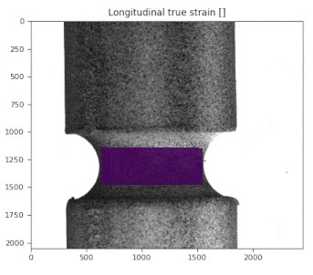
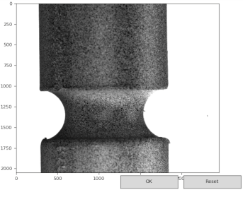

# µDIC: A Python toolkit for Digital Image Correlation (DIC)
[](https://circleci.com/gh/PolymerGuy/muDIC) [](https://codecov.io/gh/PolymerGuy/muDIC) [](https://mudic.readthedocs.io/en/latest/?badge=latest)[](https://badge.fury.io/py/muDIC)


## Overview
This project aims at providing a “batteries included” toolkit for digital image correlation in Python. 
The functionality you need to perform digital image correlation on experimental data as well as for doing virtual experiments are included.



Typical usage is demonstrated in the examples located in the /Examples folder.


This toolkit includes the following:
* Image reader tools
* Virtual lab
    * Speckle image generators
    * Image deformation tools
    * Noise injection
    * Image down-sampling
* B-spline finite elements
    * Arbitrary polynomial order
    * Knot vectors can be manipulated
* Meshing tools:
    * A light weight GUI for structured meshing
* Image correlation routines:
    * Non linear least squares solver
* Post processor
    * Calculates most popular strain measures
    * Light weight visualization
* Logging
 
 


## Getting Started

These instructions will get you a copy of the project up and running on your local machine for development and testing purposes.
### Prerequisites
This toolkit is tested on Python 2.7x an 3.7 and need all dependencies listen in requirements.txt

### Installing

#### Installing by a package manager:
Make sure you have Python 3 installed with pip and virtualenv

Make new folder and use a terminal to make a virtual environment:
```
$ python -m virtualenv env
$ source env/bin/activate #On Linux and Mac OS
$ env\Scripts\activate.bat #On Windows
```
We can now install µDIC inside this environment using pip
```
$ pip install muDIC
```
Now, lets run all the tests included by using nosetests
```
$ nosetests muDIC   #Note capital cases
```


#### Installing by cloning the repos:
Start to clone this repo to your preferred location:
```
$ cd /path/to/project/
$ git init
$ git clone https://github.com/PolymerGuy/muDIC.git
```

We recommend that you always use virtual environments, either by virtualenv or by Conda env

Virtual env:
```
$ python -m virtualenv env
$ source /env/bin/activate #On Linux and Mac OS
$ env\Scripts\activate.bat #On Windows
$ pip install -r requirements.txt
```

You can now run the tests by:
```
$ nosetests
```

## Running the tests

The tests should always be launched to check your installation.

If you installed by a package manager:
```
$ nosetests muDIC #Note capital cases
```

If you cloned the repo:
```
$ cd /path/to/project/
$ nosetests
```

## Documentation
Documentation is hosted by: [https://mudic.readthedocs.io/en/latest/]


## Our motivation
The motivation for this work was the need for a transparent code which could be modified and extended easily, without digging deep into C or C++ source code. The implementation is pure python with the exception of third-party packages such as Scipy, Numy etc.


## Contributing
Clone the repository, add your changes, add new tests and you are ready for a pull request

## Authors
* **Sindre Olufsen** - *Implementation* - [PolymerGuy](https://github.com/polymerguy)
* **Marius Endre Andersen** - *Wrote the Matlab code which was the starting point for this project*

## License
This project is licensed under the MIT License - see the [LICENSE.md](LICENSE.md) file for details

## Citing this project
This project is described in the following paper and citation is highly appreciated


