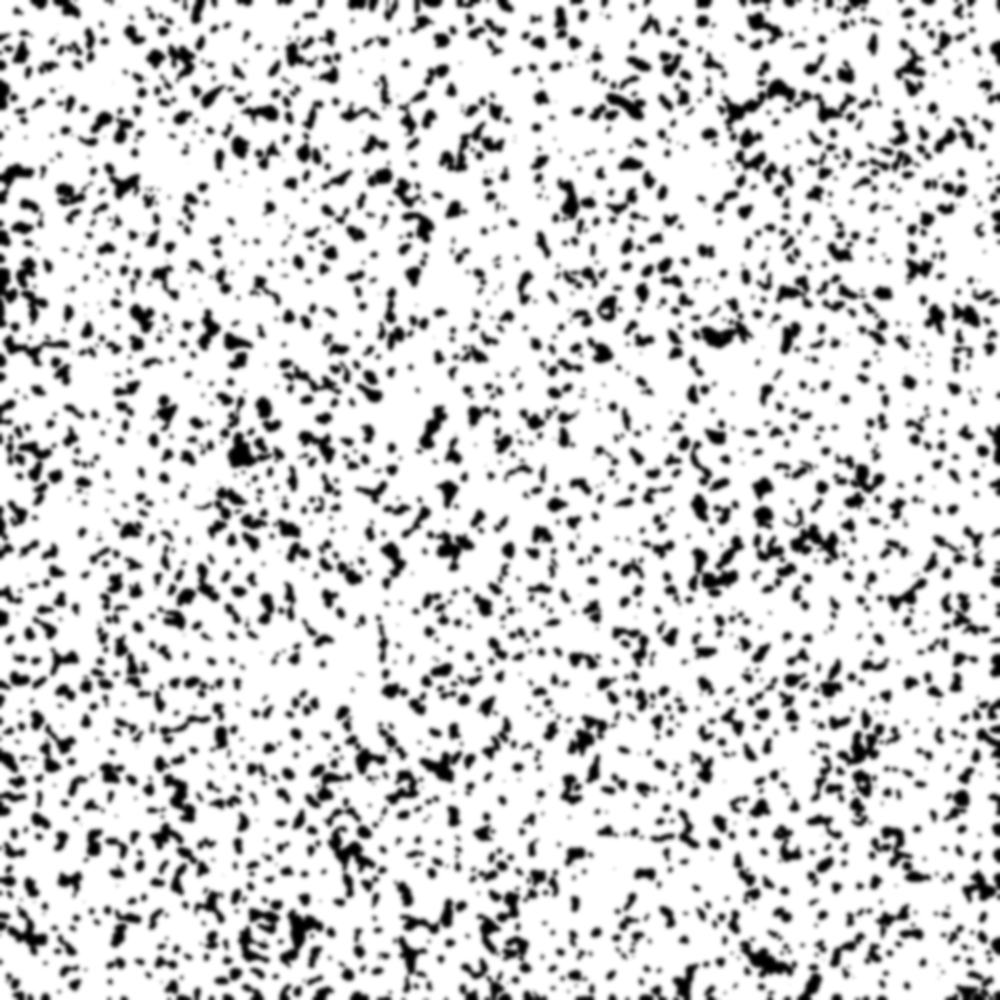
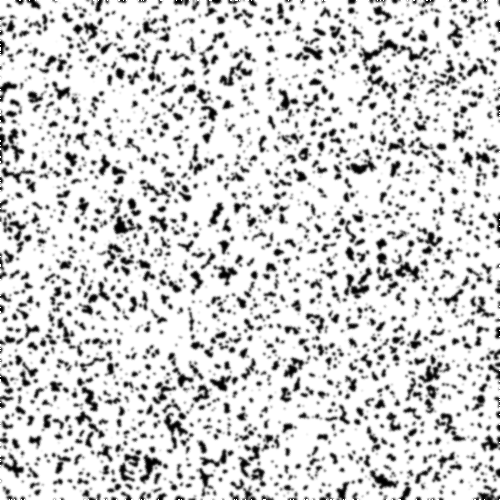
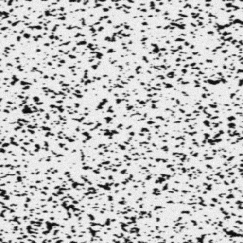

Virtual experiment
=======================================

Let's now go through how you perform virtual experiments using the virtual lab package.

First, we need to import the tools::

    import muDIC as dic
    from muDIC import vlab

Speckle image
--------------------------
We will first make a high resolution speckle image, which we later will deform and downsample.
First we declare variables for later use::

    image_shape = (2000,2000)

For making speckle images, the toolkit comes with several algorithms and we will use one called "Rosta"::

    speckle_image = vlab.rosta_speckle(
        image_shape, 
        dot_size=4, 
        density=0.32, 
        smoothness=2.0)

If you want further explaination on the arguments, you can look in the theory section or in the API docs.

The speckle image now looks like this:

Image deformer
--------------
Let's now make an image deformer which stretches the image according to a deformation gradient.
Firts, we define the deformation gradient::

    F = np.array([[1.1,.0], [0., 1.0]], dtype=np.float64)

We then make an image deformer which uses this deformation gradient::

    image_deformer = vlab.imageDeformer_from_defGrad(F)

image deformer can now take an image as argument and returns a list of deformed images::
    deformed_speckles = image_deformer(speckle_image)

Downsampler
-----------
If we want to mimic the artefacts caused by camera sensors, we can downsample the images.
I order to do this, we instantiate a downsampler::

    downsampler = vlab.Downsampler(image_shape=image_shape, 
        factor=4, 
        fill=0.8, 
        pixel_offset_stddev=0.1)

This object can now be called, returning a downsampled image::

    downsampled_speckle = downsampler(speckle_image)

A downsampled speckle would look like this:

Noise injection
---------------
We can now add noise according to noise model of our choice like this::

    noise_injector = vlab.noise_injector("gaussian", sigma=.1)

By passing an image to this function, noise is added.
By using the extreme value of sigma = 0.1, the resulting image would look like this:

.. image:: figures/noise_speckle.png
   :scale: 15 %
   :alt: The mesher GUI
   :align: center

Virtual experiment
-------------------
These components can now be composed in a script, or we can use the virtual-experiment fascility
to make an image stack directly::

    image_stack = vlab.SyntheticImageGenerator(speckle_image=speckle_image,
        image_deformer=image_deformer,
        downsampler=downsampler, 
        noise_injector=noise_injector,
        n=n)

If we as for a given image in the stack, the results from the whole pipeline will be returned::

    image_five = image_stack[5]

and would look like this:

