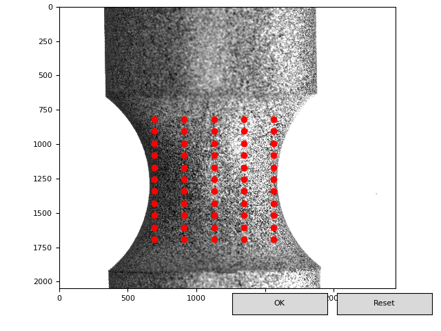

µDIC: A toolkit for digital image correlation
=======================================

This project aims at providing a "batteries included" toolktit for digital image correlation in Python.
The functionality you need to perform digital image correaltion on experimental data as 
well as for doing vitrual experiments are included. 

.. image:: examples/figures/results.png
   :scale: 45 %
   :alt: The mesher GUI

The main components:
------------------------------------
We have contructed the toolkit as a set of packages where each package provides a isolated set of tools:

* IO-Tools
* Virtual Lab
    * Speckle generation tools
    * Image deformation tools
    * Noise injection tools
    * Image downsampling tools
* Mesh generation
    * A light weight GUI for structured meshing
    * B-spline elements
        * Arbitrary polynomial order
        * Knot vectors can be manipulated
* Image correlation routines:
    * Non linear least squares solver
* Post processor
    * Calculates most popular strain measures
    * Light weight visualization

* Test suites
    * Automated function tests
 

Our motivation
--------------
The motivation for this work was the need for a transparent code which could be 
modified and extended easly, without digging deep into C or C++ source code. 
The implementation is pure python with the exception of third-party packages such 
as Scipy, Numy etc.

Contributing
------------
Clone the repository, add your changes, add new tests and you are 
ready for a pull request

Authors
-------
* **Sindre Olufsen** - *Implementation* - [PolymerGuy](https://github.com/polymerguy)
* **Marius Endre Andersen** - *Wrote the Matlab code on which this is based*

License
-------

This project is licensed under the MIT License - see the LICENSE.MD_.

.. _LICENSE.MD: https://github.com/PolymerGuy/myDIC/LICENSE.md

Citing this project
--------------------
This project is described in the following paper and citation is highly appreciated

[THE AWESOME PAPER TO BE WRITTEN, WHICH WILL PRODUCE MILLIONS OF CITATIONS]

.. toctree::
   :maxdepth: 2
   :hidden:
   :caption: First Steps

   intro/installing

.. _examples:

.. toctree::
   :maxdepth: 2
   :caption: Examples

   examples/example
   examples/vlab

.. _user-docs:

.. toctree::
   :maxdepth: 2
   :caption: User Documentation

   usedocs/io
   Virtual_lab
   usedocs/mesher
   usedocs/corelation
   usedocs/postprocessing
   
   postprocessing
   
.. _feature-docs:

.. toctree::
   :maxdepth: 2
   :glob:
   :caption: Theory

   theory/Virtual_lab
   theory/mesher
   theory/corelation
   theory/postprocessing

.. toctree::
   :maxdepth: 2
   :glob:
   :caption: API

   API/io
   API/correlator
   API/vlab

Indices and tables
==================

* :ref:`genindex`
* :ref:`modindex`
* :ref:`search`
