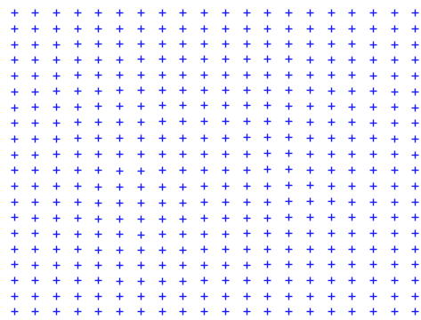
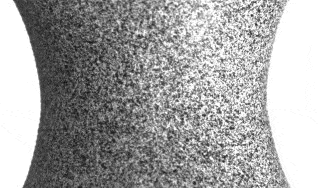
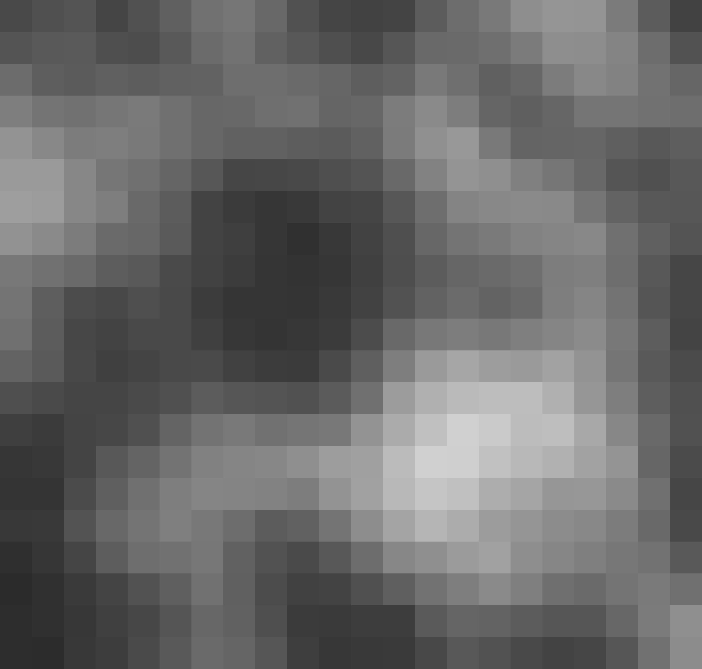
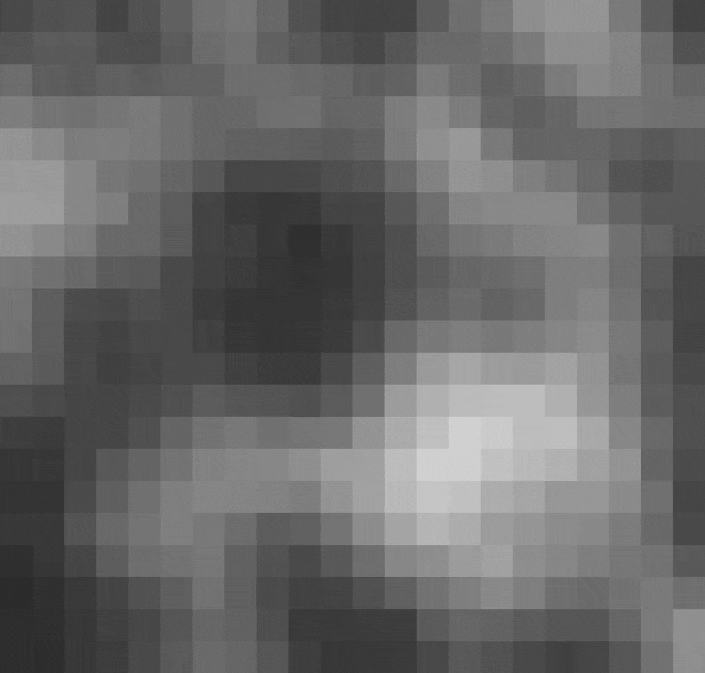
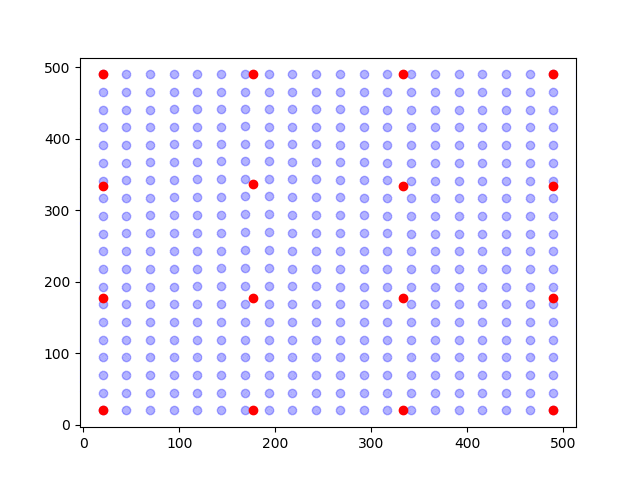
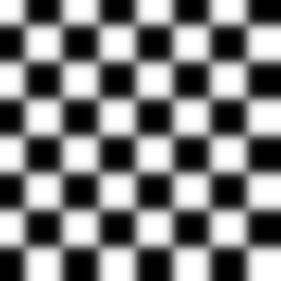
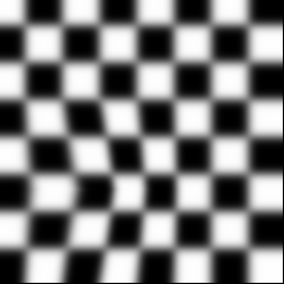
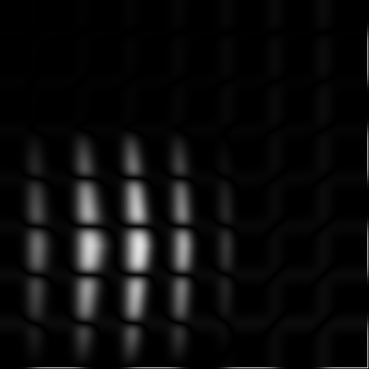
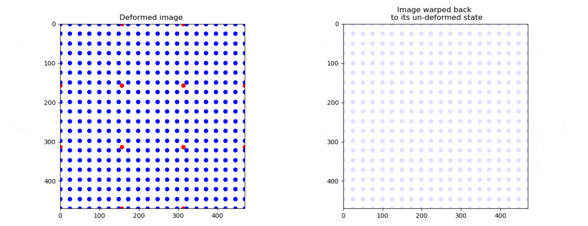

A crash-course in Digital Image Correlation
============================================

What is Digital Image Correlation?
----------------------------------
Digital Image Correlation (DIC) is a method which can be used to measure the deformation of an object based on a set of images of the object during deformation.

An ideal case might look like this:

Here we could by eyesight track every individual point and calculate their displacement.

However, in reality, the data we get tends to look like this:

Here we have painted a speckle pattern on the surface of a specimen and used a camera to capture images of the surface while
it was deformed. When we are working with such data, tracking a point on the surface of the specimen is not easily done.

First of all, there appears not be any distinct points?

If we look closer on the first image, we see the individual pixels of the image

We now assume that the grey scales of every pixel in the first image represents points on the surface, and that they are convected by the deformation
of the surface. Our objective is then to find the same greyscale values in subsequent frames.

During deformation, the greyscales are convected like we see below:

The concept that the grey scales are shifted but their value is preserved is called "conservation of optical flow" and is the fundamental assumption for DIC. In terms of equations, this can
be written as:

.. math::

    g(\boldsymbol{x}_0) = f(\boldsymbol{x})

here, :math:`g` and :math:`f` represents the grey scale values of the first image and a subsequent image respectively.
The coordinates of a set of grey scales in :math:`g` are denoted :math:`\boldsymbol{x}_0` and :math:`\boldsymbol{x}` in
:math:`f`.

So, the job of the correlation routine is to find :math:`\boldsymbol{x}`.

.. note::

    Put in simple words, we assume that the grey scale values :math:`g` at position :math:`\boldsymbol{x}_0`
    can be found in the other image :math:`f` at new positions :math:`\boldsymbol{x}`.

.. note::

    The new positions :math:`\boldsymbol{x}` are not necessarily in the center of a pixel and we therefore need to
    **interpolate** the grey scale values of  :math:`f` to determine :math:`f(\boldsymbol{x})`

**Let us look at a very common misconception...**

Misconception: We track single pixels explicitly?
----------------------------------

TLDR; No, we dont...

We could imagine that we could determine the position :math:`\boldsymbol{x}` of every individual pixel directly.

However, there are numerous problems with this direct approach. First of all, for every point in :math:`\boldsymbol{x}`
we have two unknowns, namely the two components of the coordinate, but only have one equation (the conservation of the
grey scale). In practise, tracking individual pixels in this way is not a feasible approach, and will in most cases yield a noisy and
inaccurate measurement.

Finite element discretization
-----------------------------
Ok, so we need to somehow decrease the number of unknowns. What we do then is to assume that the pixels are shifted
collectively according to an assumed kinematic. As an illustration, see the figure below.

In the figure, the points (blue dots) are shifted according
to the movement of a node (red dots). The positions of the points are determined by interpolation (aka. shape functions)
of the position of the nodes. This approach is called finite element discretization.

If we now say that the points (blue dots) are the new positions :math:`\boldsymbol{x}` ,
the objective of the solver is now reduced to find the nodal positions (red dots) which makes the grey scales found at :math:`\boldsymbol{x}` in :math:`f`
equal to the grey scales at :math:`\boldsymbol{x_0}` in :math:`g`.

.. note::

    We have now reduced our problem by having many equations (grey scale conservation of every pixel) but only a few
    unknowns (the nodal positions).

Let us now run through a correlation step
------------------------------------------
First, let us make an image of something, and let us call it :math:`g`. If we now set :math:`\boldsymbol{x_0}` to be the
coordinates of every pixel, we can plot :math:`g(\boldsymbol{x_0})`:

If this something has been deformed in the next image, let us call this image :math:`f`, we can now plot
:math:`f(\boldsymbol{x_0})`:

If we now just subtract one image from the other (:math:`g(\boldsymbol{x_0})-f(\boldsymbol{x_0})`)
we see the difference between the images:

We now clearly see that the grey scales are not conserved and that :math:`g(\boldsymbol{x_0}) \neq f(\boldsymbol{x_0})`.
Our job is now to figure out where the grey scales found at :math:`\boldsymbol{x_0}` in :math:`g` have moved.
This means that is we need to find :math:`\boldsymbol{x}` such that :math:`g(\boldsymbol{x_0}) = f(\boldsymbol{x})`

If a node is moved, the points :math:`\boldsymbol{x}` are moved like shown on the left below.
On the right side, the coordinates :math:`\boldsymbol{x}` have been moved back to their initial positions :math:`\boldsymbol{x_0}`.

Let us now sample the grey scale values of the deformed image :math:`f` at the positions :math:`\boldsymbol{x}`,
and plot the grey scales in the figure on the right at the positions where they used to be, namely at :math:`\boldsymbol{x_0}`.
This operation can be thought of as "un-warping" the image. The "un-warped" image should be equal to the undeformed image :math:`g`.

.. image:: overlay.gif

We can now see the whole operation below

.. image:: back_warping.gif

Ok, so we see that we are able to find the position of the node such that the grey scales that used to be at
:math:`\boldsymbol{x_0}` in the first picture :math:`f` are the same as found at :math:`\boldsymbol{x}` in :math:`f`.

But, how do we know that we have found the best possible match?
And how do we make a routine which does this with sub-pixel accuracy?

