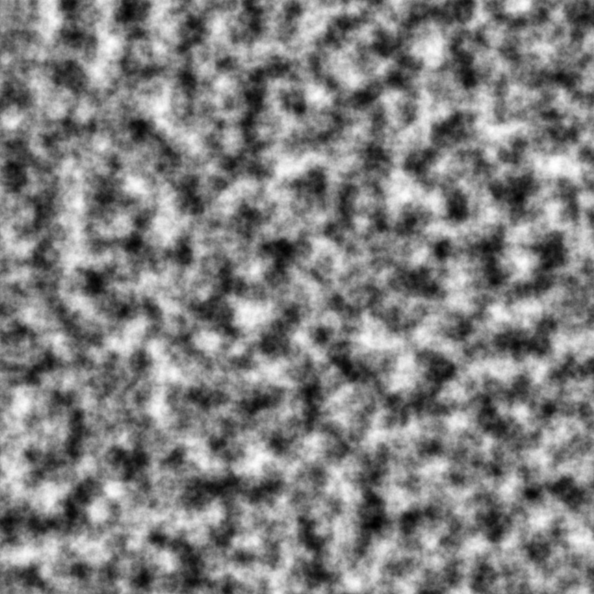
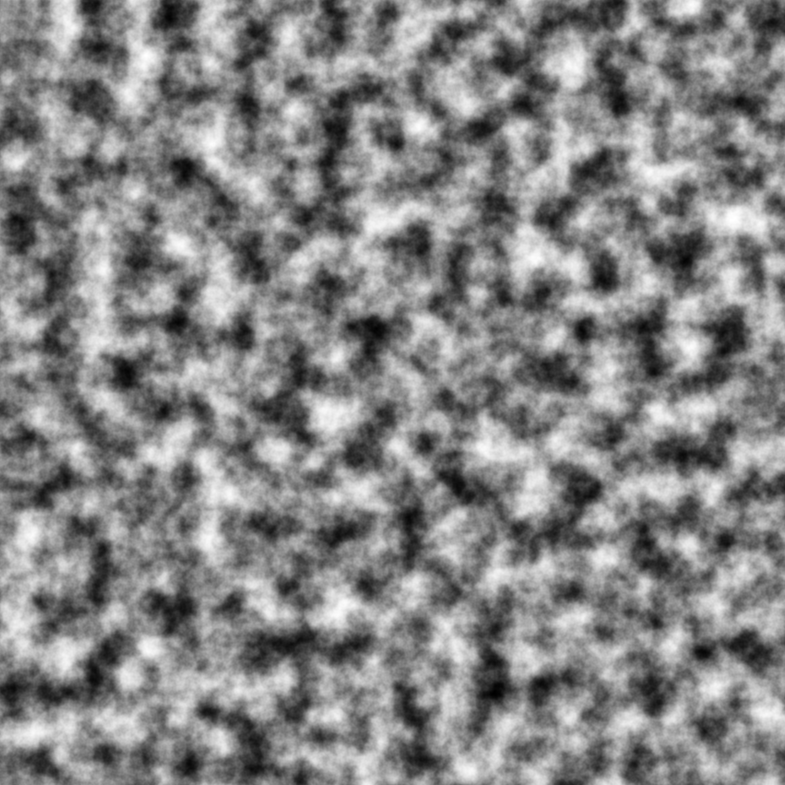
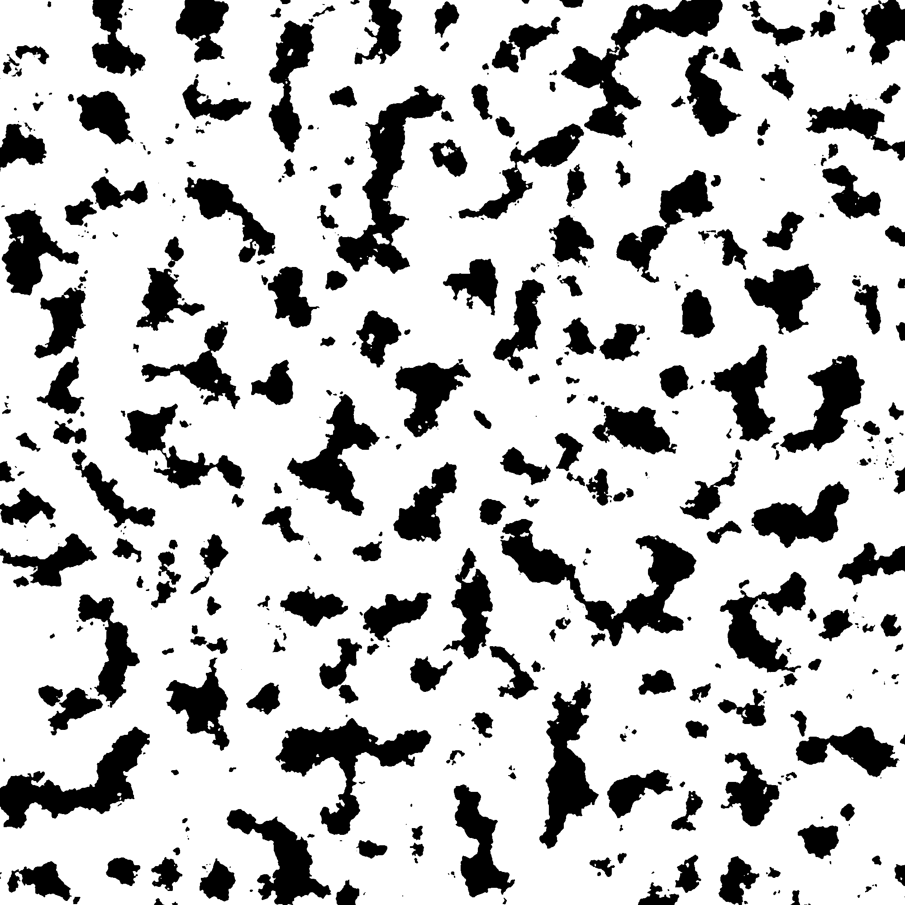

############
Speckle generation
############

Real speckle is shown below:

.. image:: ./figures/real_speckle.png

And binarized, it looks like this:

.. image:: ./figures/real_speckle_binary.png

Typical output is shown below:

Typical output with contrast boost is shown below:

which banarized looks like this:

