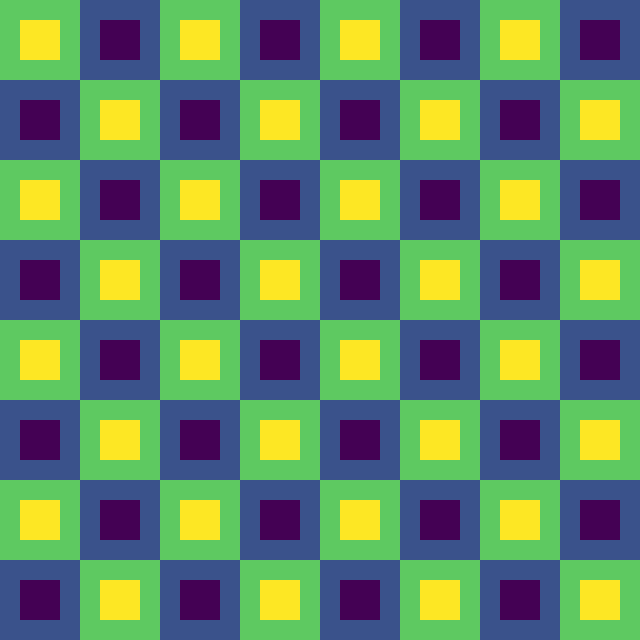

##############
Super sampling
##############

*********************
Module documentation:
*********************
.. automodule:: myDIC.virtualLab.image_down_sampling
   :members:

***************************
Module tests documentation:
***************************

The test image consist of tiles like the one below:

These are then assembled to form a mosaic like this:

.. autoclass:: myDIC.tests.test_downsample.TestDownsample
   :members:

