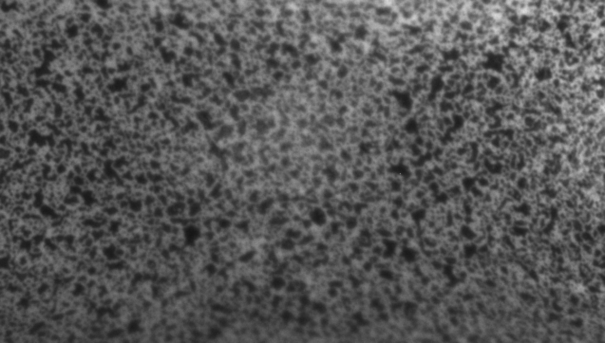
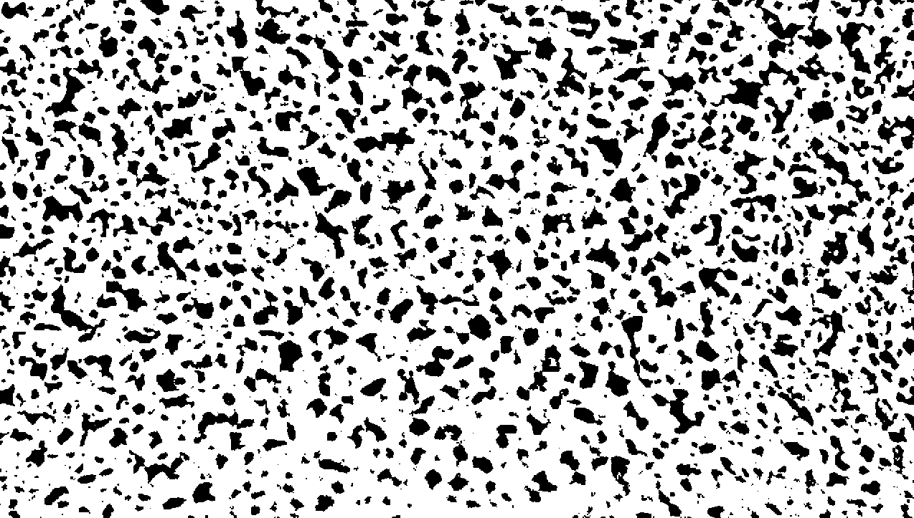
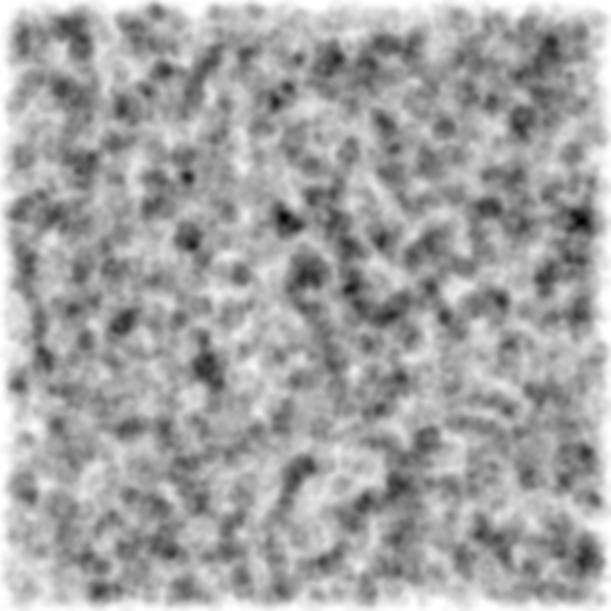

############
Spray speckle generator
############

Sneeze is a algorithm which does the following:

* Initializes an empty canvas
* Generates a random:
   * Ink drop radius
   * Ink drop location
* Appends the drop to the canvas
* GOTO 1. if more drops are to be added
* Apply Gaussian blur to round the droplets

Real speckle is shown below:

And binarized, it looks like this:

Typical output is shown below:

